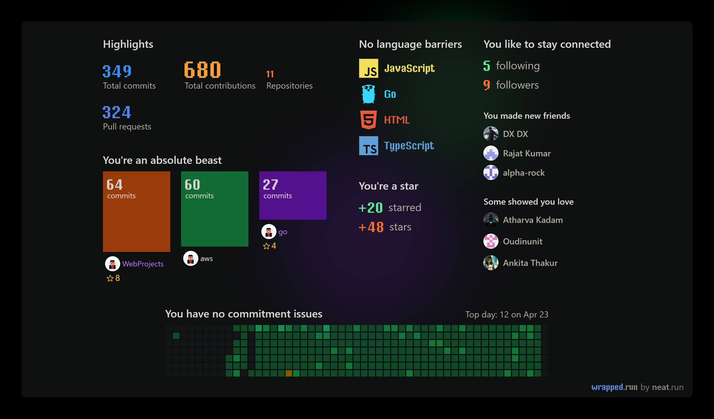

# Hi there 👋, My name is Akash Sisodiya

## About Me

- 🖥️ I'm a Software Engineer from India.
- 👨‍💻 I'm currently working as Go Lang & C# Developer and Multi-Cloud Engineer (AWS & Azure)
- 🤓 I'm a self-taught Designer, and a VR/AR Developer, also Azure Data Engineer Certified (DP-203)
- 🔭 In my personal time I like working on Web App Development & 3D Modeling
- 🌱 I’m currently learning React Native & 3D Modeling
- 👯 I’m looking to collaborate on Educational App
- 💬 Ask me anything about Physics, my Tech Stack or Movies and TV Series
- 😄 Pronouns: He/Him
- ⚡ Fun fact: Everything is Awesome!
- ❤️ Physics

## Technologies I Have Worked With

## My Github Stats

<!--  -->

## Technologies I Work With In My Spare Time

## Technologies I am Exploring

## Find Me @

---

