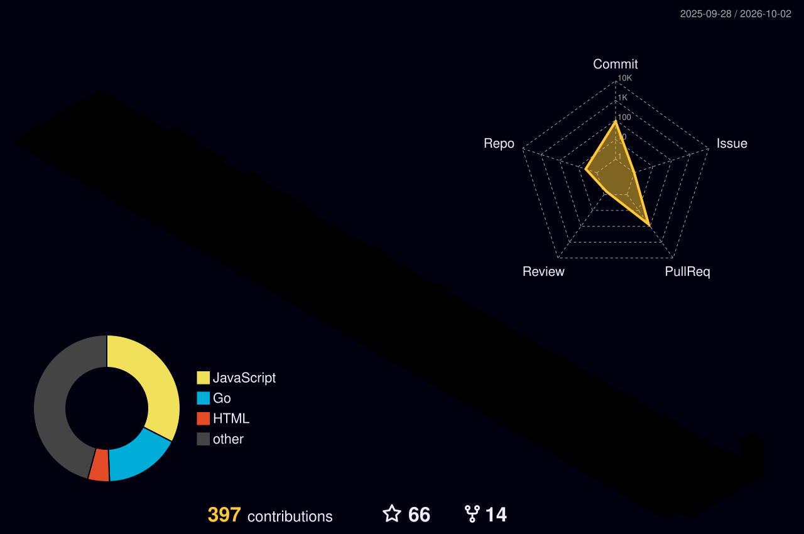

# Hi there 👋, I'm Akash Sisodiya

## About Me

- 🖥️ Software Engineer from India with **9+ years** of professional experience (11+ including internships)
- 👨‍💻 Currently working as an **AI Software Developer / Data Engineer** at **Unify Dots**
- ☁️ 8+ years building web applications, APIs and data platforms on **AWS** and **Azure** using Go, C#, Node.js and Python
- 🤖 Building production AI agents with **Microsoft Copilot Studio**, **Microsoft 365 Copilot** and the **Power Platform**
- 📊 Data engineering with **Azure Synapse Analytics**, Azure Data Warehouse and AS400-to-Azure migration pipelines
- 🤓 Self-taught designer and VR/AR developer
- 🔭 Passionate about web app development, 3D modeling, and immersive experiences
- 🌱 Currently learning Agentic Development and 3D Modeling
- 👯 Open to collaborating on educational apps and innovative product ideas
- 💬 Ask me anything about Physics, my tech stack, or movies and TV series
- 😄 Pronouns: He/Him
- ⚡ Fun fact: Everything is Awesome!
- ❤️ Physics

## Certifications

[-0078D4?style=for-the-badge&logo=microsoftazure&logoColor=white)](https://learn.microsoft.com/credentials/certifications/azure-data-engineer/)
[-0078D4?style=for-the-badge&logo=microsoftazure&logoColor=white)](https://learn.microsoft.com/credentials/certifications/azure-data-fundamentals/)

## Live Projects

| Project | Description |
| --- | --- |
| 💊 **[Pharm-Edu](https://pharm-edu.xyz/)** | A study platform for B.Pharm students with notes, MCQs, previous-year questions, flashcards, a patient simulator and discussion forums. Students can track progress with streaks, badges, leaderboards and activity heatmaps. |
| 😊 **[Emotion Tracker](https://emotrackr.netlify.app/)** | A daily mood and habit check-in app that shows your entries on a monthly emoji calendar and a year-long contribution graph. Your data stays on your device by default. |
| 🥄 **[BabySpoon](https://babyspoon.netlify.app/)** | A baby care companion app for planning meals, tracking hydration and following your baby's growth. |

## Core Tech Stack

## AI & Automation

## Tools, Frameworks, and Platforms

## Current Focus

- 🚀 Agentic development and AI-powered workflows with Copilot Studio and Microsoft 365 Copilot
- 📊 Data migration and analytics pipelines on Azure Synapse
- 🧩 Building multi-cloud solutions and resilient back-end systems
- 🌐 Exploring immersive web and 3D experiences
- 🎓 Creating ideas and products around education and learning

## Find Me @

## GitHub Stats

---

